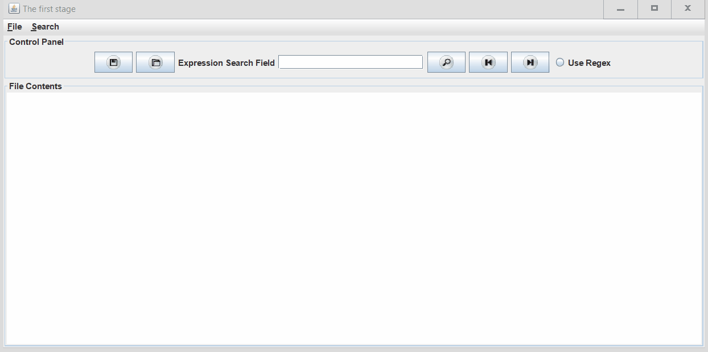
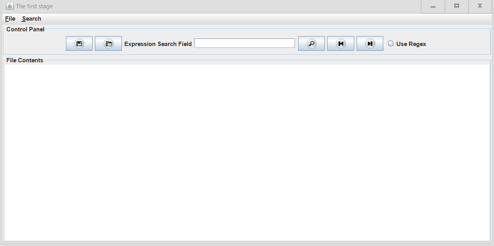
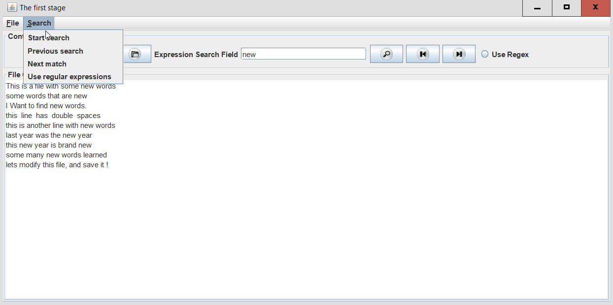

#### Thanks to [JetBrains Academy](https://hi.hyperskill.org/) and [Hyperskill](https://hi.hyperskill.org/platform) , without them this project wouldn't be done.

#### Text Editor - Java Written

#### My take on this project

I have learned so many things throughout this course or java online project, this project is labeled as a "nightmare" level, one of a few top hard to do projects on the hyperskill / jetbrains platform for learning java. The first 3 stages I cruised through them without any major problems, a few memory refreshers here and there for dealing with GUI components, resizing, creating button icons, scaling, cropping, and making things look neat and stay where they should be when you minimize / maximize windows. The most challenging part that I found in this project was the regular expression searching and iterating through all the results using buttons and menus. The challenging part was how to find a pattern within a given file, and how to select that very first occurrence of the pattern, and be able to know which occurrence that is, so that the user can iterate back and forth from any pattern occurrence within the file content. Phew, after a few lesson browsing and stackoverflow searching, and Java docs reading, and book browsing, and some stubbornness and persistence, I was able to compile and run this little baby of mine. Scroll down to see the list of some of the topics covered in this project.

#### Functionalities

This text editor can read/save from/to local filesystem, modify files , create new files, search for patterns within files, iterate through search results, and use regular expression search. Other than the buttons for open/save/search, it has a menu with File and Search submenus. Here are a few more screenshots of the project:

###### filesystem browsing

###### viewing file contents

###### menu and submenus

###### saving files

###### search and iterate through patterns in a file

#### Topics covered in this project:

This project encompasses many topics to learn from for all old and new Java code lovers. Some of the topics covered are :

- Java Basics
  - Literals
  - Primitive Types
  - Write, Compile, Run
  - Intro to OOP
  - For Loops
- GUI Design and Implementation
  - Java GUI Layouts
- Reading/Writing Files
  - Scanner
- JFileChooser ( filesystem browsing)
- Regex ( regular expression searching )
- Multithreading
- Data Structures
  - Dynamic Data Structures
  - List, Queue, Stack, ArrayList, Sets
  - The Colllections Framework
- Exception Handling
  - IOException
  - NullPointerException

#### A Quick Conclusion:

I really enjoyed doing this project, looking forward to doing another one on the hyperskill platform soon. Perhaps not a nightmare this time :)